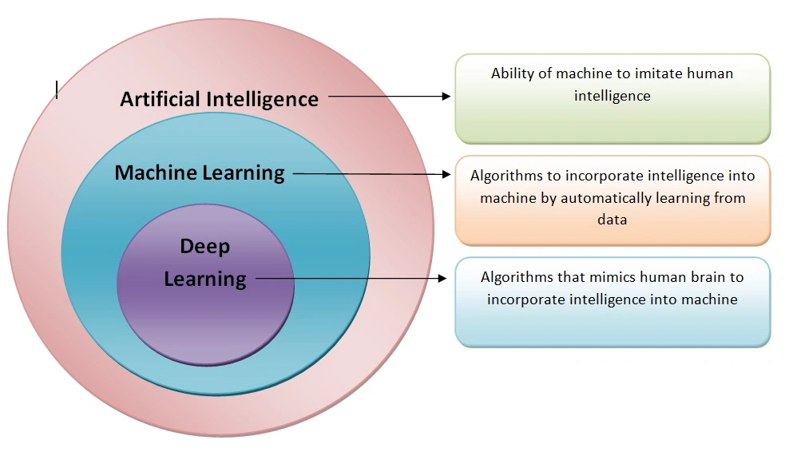
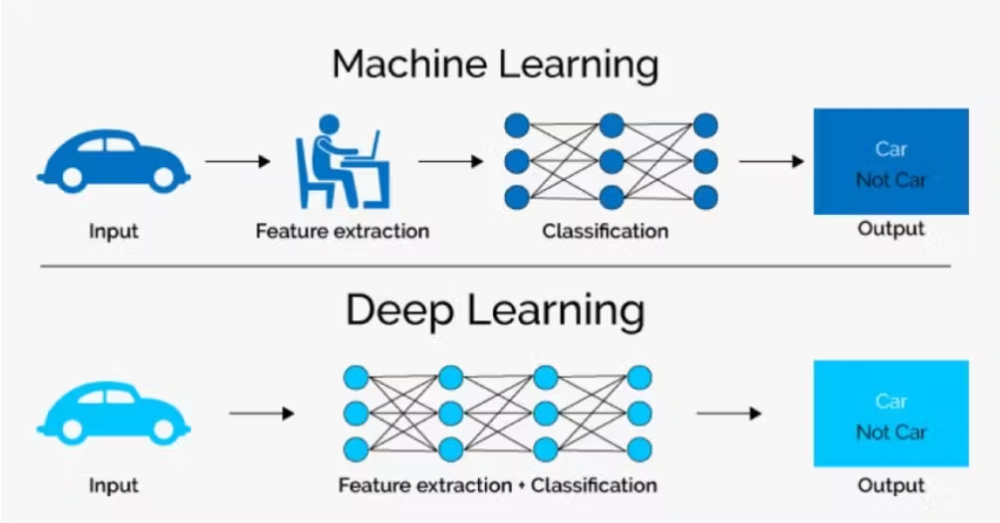

# Day 02 
## Table of Content

- [Day 02](#day-02)
  - [Table of Content](#table-of-content)
- [What is Artificial Intelligence?](#what-is-artificial-intelligence)
    - [1. Defining Artificial Intelligence](#1-defining-artificial-intelligence)
    - [2. How AI Systems Function](#2-how-ai-systems-function)
    - [3. The Role of Data in AI](#3-the-role-of-data-in-ai)
    - [4. Key Characteristics of AI](#4-key-characteristics-of-ai)
    - [5. Applications of Artificial Intelligence](#5-applications-of-artificial-intelligence)
    - [6. Types of Artificial Intelligence](#6-types-of-artificial-intelligence)
  - [AI vs Data Science](#ai-vs-data-science)
  - [Artificial Intelligence and  Machine Learning](#artificial-intelligence-and--machine-learning)
  - [Machine Learning and Deep Learning](#machine-learning-and-deep-learning)
  - [Benefits in our Daily Life](#benefits-in-our-daily-life)

----

# What is Artificial Intelligence?

### 1. Defining Artificial Intelligence

* AI refers to the capability of machines to perform tasks that typically require human intelligence.
* A core aspect of AI is the automation of tasks previously handled by humans, such as communication

### 2. How AI Systems Function

* AI systems utilize computer systems or machines designed to execute tasks that generally demand human cognitive abilities 
* These capabilities include areas like visual perception and speech recognition 

### 3. The Role of Data in AI

* AI systems learn and evolve by analyzing data to generate predictions and make informed decisions 
* The quality and nature of the data used are critical factors that directly influence the effectiveness and performance of the AI

### 4. Key Characteristics of AI

* **Learning:** AI systems possess the ability to learn from data and progressively improve their performance over time
* **Reasoning:** AI employs logical processes to analyze situations and solve problems effectively.
* **Self-correction:** AI systems can evaluate their outputs, identify areas for improvement, and refine their performance autonomously
* **Adaptability:** AI demonstrates the capacity to adjust to new and unfamiliar situations, even without explicit prior training for those specific scenarios.
  
### 5. Applications of Artificial Intelligence

* **Natural Language Processing (NLP):** This field enables machines to comprehend, interpret, and process human language effectively
* **Computer Vision:** This area equips machines with the ability to "see," interpret, and understand visual information from images and videos. 
* **Robotics:** AI plays a crucial role in the development of autonomous robots and intelligent vehicles capable of performing tasks independently 
* and much more. 

### 6. Types of Artificial Intelligence

* **Narrow AI (Weak AI):** This type of AI is designed and trained to excel at specific, well-defined tasks 
* **General AI (Strong AI):** This more advanced form of AI possesses broader cognitive capabilities, exhibiting intelligence more akin to human-level understanding and problem-solving abilities 

----

## AI vs Data Science

**What is AI?**
Artificial Intelligence is a branch of computer science that focuses on building smart machines that can perform tasks that typically require human intelligence—like recognizing speech, understanding language, and playing games.

**What is Data Science?**
Data Science involves extracting useful knowledge and insights from data. It uses statistics, machine learning, data visualization, and domain knowledge to solve problems.

Feature| Artificial Intelligence (AI)| Data Science 
---------|----------|---------
 Goal | Create intelligent systems | Extract insights from data
 Techniques Used | ML, DL, NLP, expert systems | Statistics, ML, data cleaning visualization
 Applications | Chatbots, self-driving cars, virtual assistants | Fraud detection, customer insights, forecasts
 Focus | Intelligence and automation | Data analysis and decision-making

 ---

## Artificial Intelligence and  Machine Learning
Think of AI as the big umbrella, and ML is one of its branches. ML helps in building AI systems by allowing machines to learn from data.

Feature | Artificial Intelligence | Machine Learning 
---------|----------|---------
 Scope | Broad: covers many techniques | Narrow: focused on learning from data
 Object | Mimic human intelligence | Learn and improve from experience
 Techniques | Includes ML, rule-based systems | Includes supervised, unsupervised learning

## Machine Learning and Deep Learning 
 

**Machine Learning (ML)**
ML is a subset of AI that enables machines to learn from data without being explicitly programmed. It uses algorithms to identify patterns and make predictions.

**What is Deep Learning (DL)?**
DL is a subset of ML that uses neural networks with many layers (hence "deep") to analyze different types of data, especially unstructured data like images and audio.

Feature |  Machine Learning | Deep Learning 
---------|----------|---------
Data Requirements | Can work with smaller datasets | Requires large amounts of data
Algorithms used |Decision trees, SVM, KNN, etc.  | Neural networks (CNN, RNN, etc.)
Hardware Dependency |Can run on CPU | Often requires GPU
Feature Engineering | Manual | Automatic (DL learns features by itself)

## Benefits in our Daily Life 
* **Increased Productivity**: AI automates repetitive tasks, freeing up time for more strategic activities. For example, AI-powered tools can sort emails, schedule meetings, and manage calendars.
* **Enhanced Decision-Making**: AI excels in data analysis, providing valuable insights and trends to improve decision-making processes. It can predict sales trends, identify customer preferences, and recommend optimal pricing strategies.
* **Improved Personalization:** AI enhances user experiences by delivering personalized content and recommendations. Streaming services and online retailers use AI algorithms to suggest movies, shows, songs, and products based on user preferences.
* **24/7 Availability and Customer Service**: AI-powered chatbots and virtual assistants provide instant responses to customer inquiries, resolve issues, and offer product information at any time.
* **Advances in Healthcare**: AI aids in diagnostics, treatment planning, and patient care. AI systems can analyze medical images to detect diseases and recommend personalized treatment plans.
* **Enhanced Transportation**: AI is used in self-driving cars, GPS systems to plot routes, and traffic analysis to ease congestion.
* **Financial Services**: AI can assess customer financial records, make stronger recommendations, and detect fraud.
* **Improved Agriculture**: AI is used to optimize farming practices and increase crop yields.
* **Enhanced Cybersecurity:** AI can detect and mitigate cyber threats, such as hacking attempts and ransomware.
* **Simplifies Content Creation**: AI tools can generate art, music, and written content, providing new ideas and inspiration.
* **Personalized Education**: AI-powered educational platforms adapt to individual learning styles, providing customized lessons and feedback.